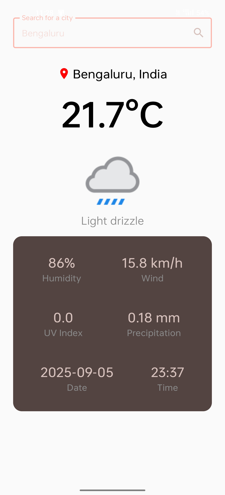

# Weather App 🌤️

A clean and intuitive weather application that provides current weather information for any city worldwide.

## Features

- 🔍 **City Search**: Easy-to-use search functionality to find weather information for any city
- 🌡️ **Current Temperature**: Real-time temperature display in Celsius
- 🌤️ **Weather Conditions**: Visual weather icons with condition descriptions
- 💧 **Detailed Metrics**: Humidity, wind speed, UV index, and precipitation data
- 📅 **Date & Time**: Current date and time information
- 📍 **Location Display**: Clear city and country identification

## Screenshots

### Home Screen
The clean, minimalist interface welcomes users with a simple search prompt.

### Weather Display
Comprehensive weather information displayed in an easy-to-read format with all essential metrics.

## Usage

1. Enter a city name in the search box
2. Tap the search button or press enter
3. View comprehensive weather information including:
   - Current temperature
   - Weather conditions
   - Humidity and wind speed
   - UV index and precipitation
   - Current date and time

## Weather Data Includes

- **Temperature**: Current temperature in Celsius
- **Conditions**: Weather description with appropriate icons
- **Humidity**: Relative humidity percentage
- **Wind Speed**: Wind velocity in km/h
- **UV Index**: Ultraviolet radiation level
- **Precipitation**: Rainfall amount in mm
- **Location**: City and country identification
- **Timestamp**: Current date and time

---

*Built with ❤️ for accurate and accessible weather information*
